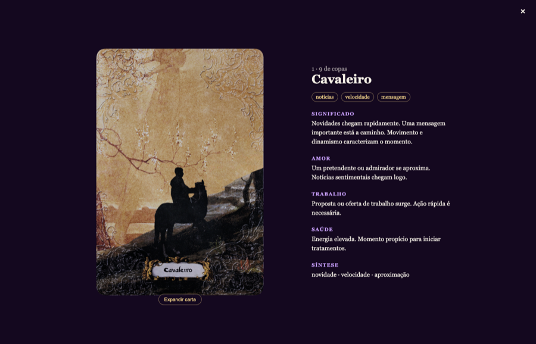

# Baralho Cigano

As 36 cartas do baralho cigano numa grade, como um feed. Toque numa carta para abrir a página dela: uma vitrine 3D (gire com o mouse ou o dedo, veja a luz refletir na carta) e a wiki completa — significado, amor, trabalho, saúde e síntese.



## Recursos

- Grade responsiva com as 36 cartas, que se adapta a qualquer tela.
- Cada carta "salta" ao passar o mouse (ou ao tocar e segurar no celular).
- Página da carta: uma vitrine 3D com a carta sozinha, que gira ao arrastar e reflete as luzes do ambiente. Um botão expande a vitrine para ocupar a tela quase toda.
- No desktop, a página usa vitrine e texto lado a lado; no celular, empilhados.
- Fecha com o botão ×, com Esc, ou recolhendo a vitrine expandida.

## Stack

| Área | Ferramentas |
| --- | --- |
| App | React 19, TypeScript, Vite |
| 3D | three.js, React Three Fiber, drei |
| Testes | Vitest, Testing Library, React Three Test Renderer |
| Qualidade | Biome (lint e formatação), Lefthook (git hooks) |

## Começando

Requisitos: Node.js 20.19+ ou 22.12+ e pnpm.

```bash
pnpm install
pnpm dev
```

O `pnpm install` também instala os git hooks.

## Comandos

| Comando | O que faz |
| --- | --- |
| `pnpm dev` | Sobe o app em modo de desenvolvimento |
| `pnpm build` | Checa os tipos e gera o build de produção em `dist/` |
| `pnpm preview` | Serve o build de produção localmente |
| `pnpm test` | Roda os testes uma vez |
| `pnpm test:watch` | Roda os testes em modo watch |
| `pnpm lint` | Checa lint e formatação |
| `pnpm format` | Corrige lint e formatação |

A cada commit, o Lefthook roda o Biome nos arquivos em stage, a checagem de tipos e os testes.

## Estrutura

```
public/cards/            artes das cartas e o verso (back.svg)
src/
  App.tsx                estado da carta selecionada
  data/
    cards.json           conteúdo da wiki, na ordem do baralho
    cards.ts             junta o conteúdo com id e caminho da imagem
  useEscapeKey.ts         fecha um painel ao apertar Esc
  components/
    Gallery/              a grade de cartas
    CardDetail/            a página de uma carta: vitrine 3D + conteúdo, com o botão de expandir
    CardShowcase/          o canvas 3D com uma única carta em destaque
    CardContent/           nome, palavras-chave e as seções da wiki (usado só por CardDetail)
    Card/
      Card.tsx             a carta 3D: formato, material, arraste, giro
      geometry.ts          formato da carta e proporção das artes
    SceneLighting/          luzes e reflexos, compartilhados pelas cenas 3D
tests/                    espelha a estrutura de src/
docs/                     imagens do README
```

Cada componente fica na sua própria pasta, com o seu teste no mesmo caminho dentro de `tests/`. O estado é só o `selectedId` no `App`.

## Personalizando o baralho

### Imagens

Coloque as artes em `public/cards/` e aponte cada carta para o seu arquivo com o campo `image` em `src/data/cards.json`:

```json
{ "image": "cavaleiro1.webp", "name": "Cavaleiro", … }
```

Uma carta sem `image` usa a imagem provisória `NN.svg` (01 Cavaleiro … 36 Cruz). O verso é o `public/cards/back.svg`, referenciado em `src/components/CardShowcase/CardShowcase.tsx`.

A carta 3D segue a proporção das artes, 791×1169. Se as suas artes tiverem outra proporção, ajuste `ARTWORK_ASPECT` em `src/components/Card/geometry.ts`. As miniaturas da grade nunca passam de uns 300 px de largura, então dá para reduzir as imagens para esse tamanho e salvar em WebP — isso diminui bastante o download.

### Conteúdo

Edite `src/data/cards.json`. Cada entrada tem:

```json
{
  "image": "cavaleiro1.webp",
  "name": "Cavaleiro",
  "playingCard": "9 de copas",
  "keywords": ["notícias", "velocidade", "mensagem"],
  "meaning": "…",
  "love": "…",
  "work": "…",
  "health": "…",
  "synthesis": ["novidade", "velocidade", "aproximação"]
}
```

O tipo `CardData` é inferido do JSON, então um campo novo já fica disponível no TypeScript. Para mostrá-lo, é só editar `src/components/CardContent/CardContent.tsx`.

### Ajustes finos

As constantes ficam no topo de cada arquivo:

| O quê | Onde |
| --- | --- |
| Velocidade da animação, sensibilidade do arraste, inclinação máxima, acabamento da carta (`FINISH`) e cor da borda (`EDGE_COLOR`) | `src/components/Card/Card.tsx` |
| Proporção, tamanho e raio dos cantos | `src/components/Card/geometry.ts` |
| Colunas, tamanho mínimo e animação de "salto" da grade | `src/components/Gallery/Gallery.css` |
| Altura da vitrine, ponto de quebra do layout lado a lado e o botão de expandir | `src/components/CardDetail/CardDetail.css` |
| Cores, luzes e reflexos que a carta reflete | `src/components/SceneLighting/SceneLighting.tsx` |

## Testes

Os componentes 3D são testados com o React Three Test Renderer, que monta a cena sem WebGL e permite disparar eventos e avançar quadros. Os componentes HTML usam o Testing Library com jsdom.

## Licença

Todos os direitos reservados. Veja [LICENSE](LICENSE).
